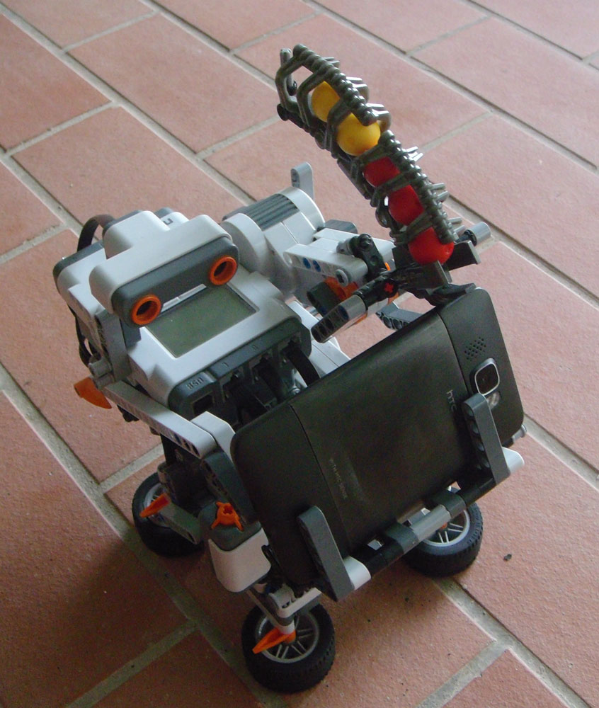

A Lego Mindstorm robot holding an Android phone is connected to a Windows PC via Bluetooth. The PC receives the phone's camera feeds over WiFi and processes them using OpenCV to detect the human's face. The obtained data is being used in a C++ application and the final commands will be transmitted to the NXT unit to do the shooting.

## Techniques

-   Robotic movement and sensing control via Bluetooth (Using [Monobrick C++ Communication library](http://www.monobrick.dk/software/c-library/) for NXT)
-   Wifi camera feeds streaming (Using [IP Webcam Android app](https://play.google.com/store/apps/details?id=com.pas.webcam) and [MJPG-Streamer](http://sourceforge.net/files/mjpg-streamer/))
-   Face detection using Haar classifiers (Using OpenCV library)

## Demo
