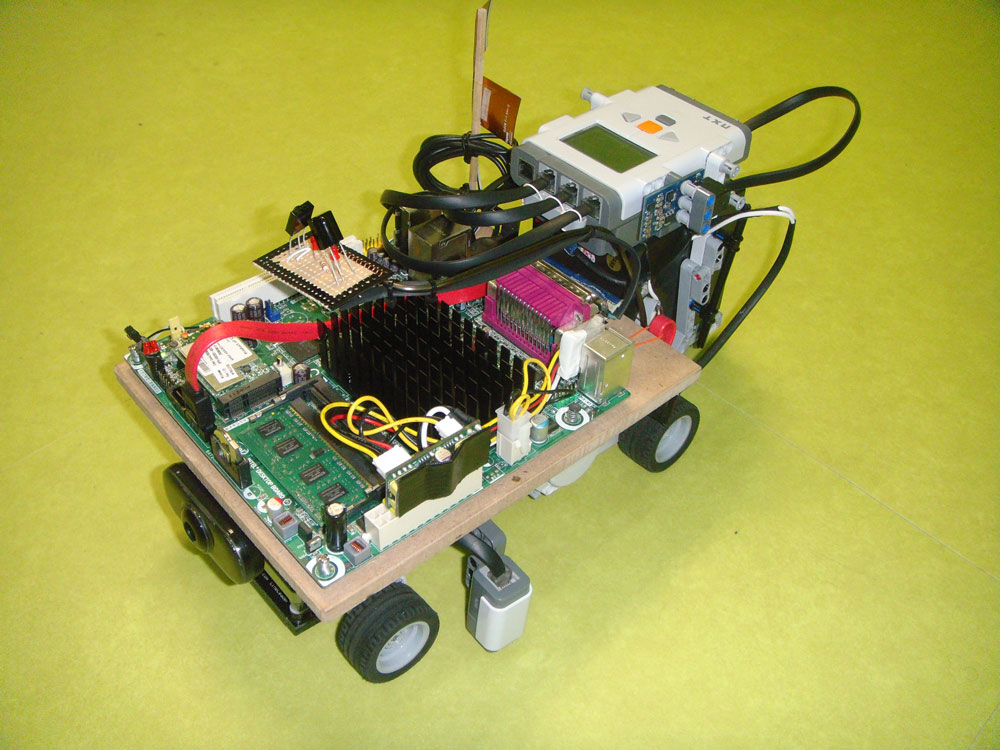
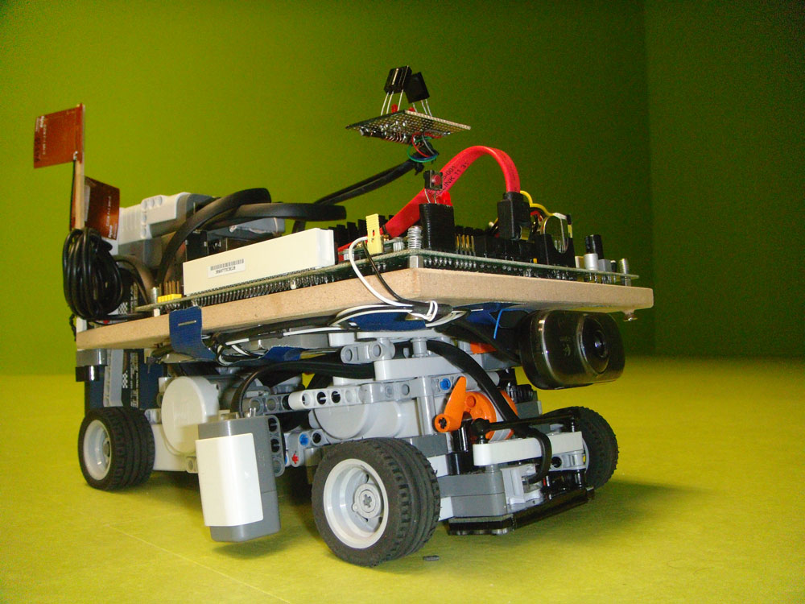

Concept: The strength of network signals (cellular, wifi, etc.) vary over time with respect to environmental changes. To ensure a reliable network coverage, service providers spend notable amound of resources to detect blackspots periodically. While relying on user feedbacks is not always an ideal solution due to their hardware specifications, autonomous vehicles can utilized to do the job.

This was a project sponsored by Intel to utilize the Intel® Atom™ Board D525MW in an embedded system.

A robot and a scale model (simulated city) were developed to showcase the concept.

## Robot


-   [Intel® Desktop Board D525MW](http://www.intel.my/content/www/us/en/motherboards/desktop-motherboards/desktop-board-d525mw.html)  powered with a  [PicoPSU-90](http://www.mini-box.com/picoPSU-90)  power supply
-   [NXT Mindstorm Unit 2.0](http://en.wikipedia.org/wiki/Lego_Mindstorms_NXT)  with Color Sensor
-   [dIMU](http://www.dexterindustries.com/dIMU.html)  - Inertial Motion Sensor
-   [NXTLineLeader](http://www.mindsensors.com/index.php?module=pagemaster&PAGE_user_op=view_page&PAGE_id=111)  - Infrared Line Sensors
-   Infrared Receivers (Interfacing with Intel Board using LPT port)
-   USB Camera

## Scale model

-   Traffic lights (Controlled with an  [AVR Mega Micro-controller](http://www.atmel.com/products/microcontrollers/avr/megaavr.aspx))
-   Infrared Transmitters (With  [555 timers](http://en.wikipedia.org/wiki/555_timer_IC))

## Techniques

-   Robotic movement and sensing control of NXT Components (Using  [RobotC](http://www.robotc.net/))
-   Traffic lights detection using USB Camera connected to Intel Board (Using  [OpenCV Library](http://opencv.willowgarage.com/wiki/))
-   Infrared signal strength detection using IR Receivers connected to LPT Port of the Intel Board
-   Bluetooth message passing between NXT and the Intel Board (C# Bluetooth Sockets)
-   Traffic light control system with AVR Micro-controller (Using  [Bascom AVR](http://www.mcselec.com/index.php?option=com_content&task=view&id=14&Itemid=41))
-   IR Signal Transmissions with 555 timer ICs.

## Demo


<!-- ## Report
[Autonomous_Data_Collector_Robot.pdf](Autonomous_Data_Collector_Robot.pdf) -->