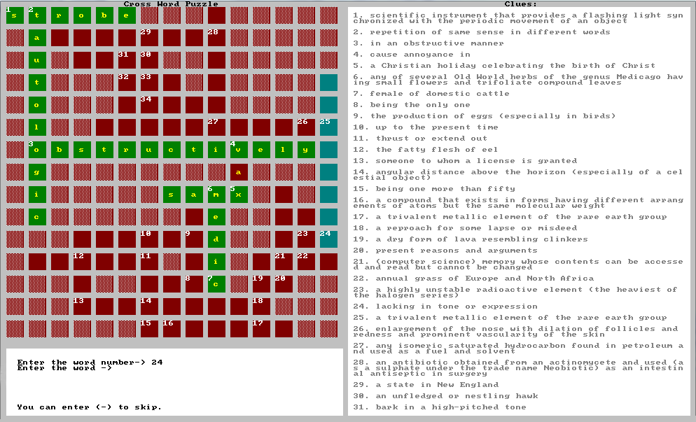

A crossword puzzle is a word puzzle in form of gird of shaded and empty squared. Each empty square can accept one letter from user which eventually forms rows and columns of words. Each word in the puzzle contains an equivalent clue that guides the user to an answer. Shaded squares are places to indicate blocked cells that cannot contain any character and are usually used to separate words from each other.
Each word in the puzzle is indicated with a number at the starting character and that character may be the starting character of one or more letters in different directions.

A square may contain characters that are part of one or more words. The character may be a starting, middle or even an ending character.

## Random Crossword Puzzle

In this application, a dictionary database containing more than 100 thousand words and definitions has been used to collect random set of words and clues each time a table is to be generated. The puzzle will be generated with a greedy algorithm based on randomly collected words from the database.

## Source Code
https://github.com/farshidtz/random-crossword