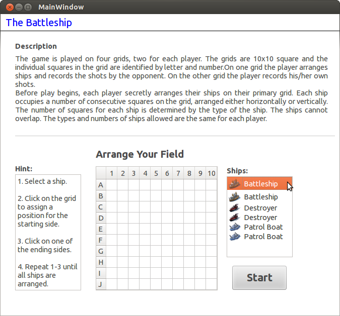
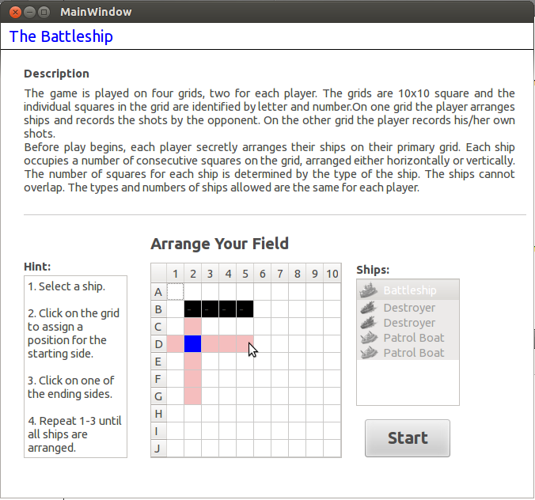
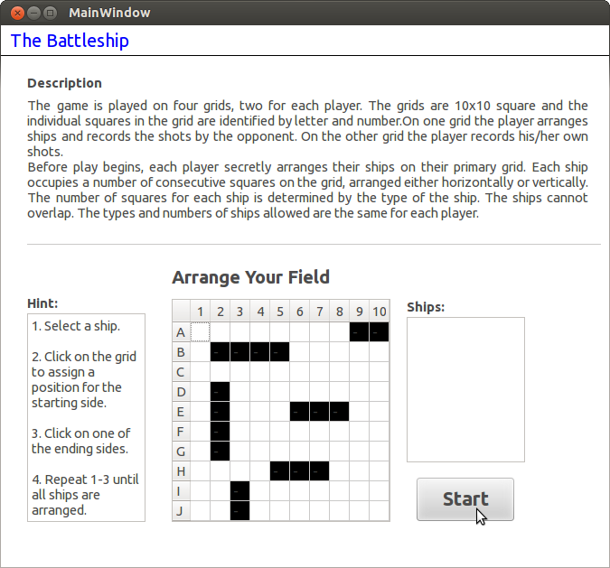
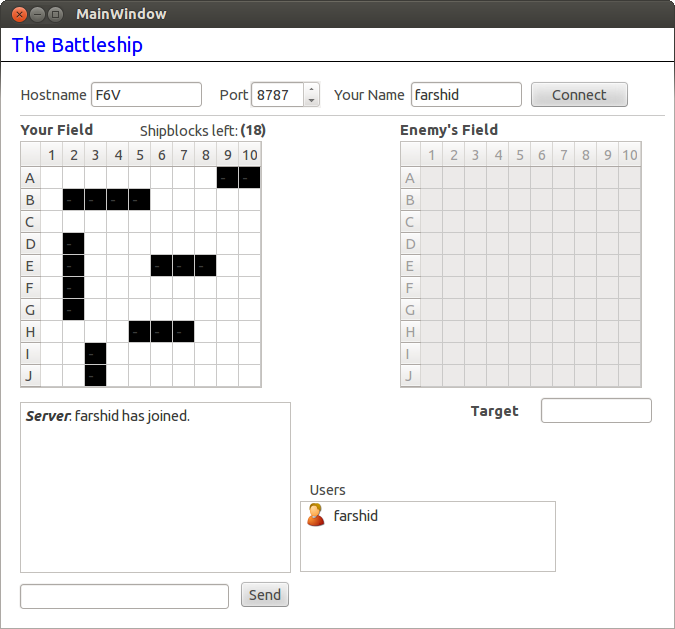
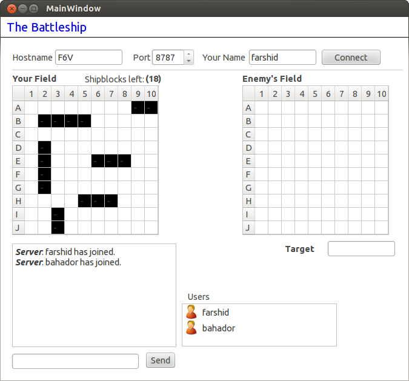
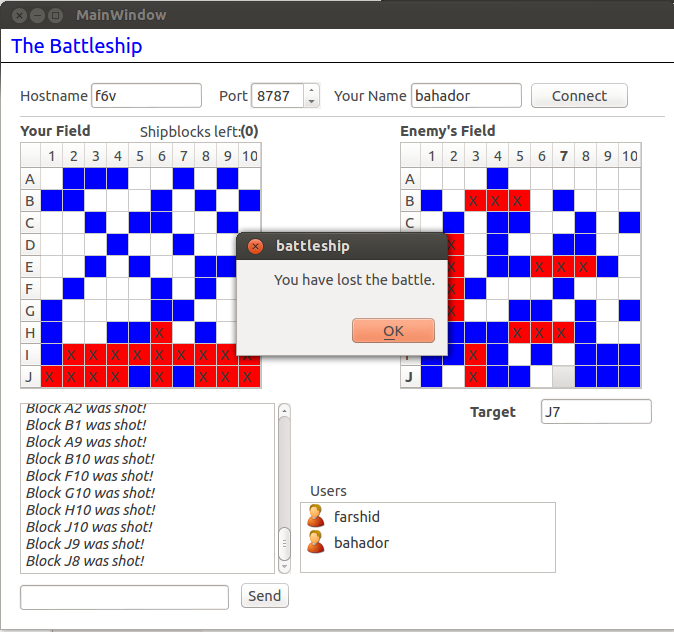
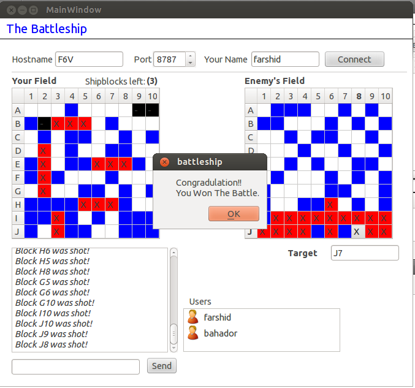
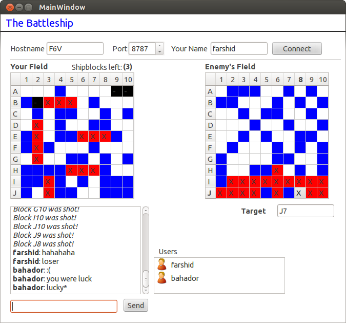

The [Battleship game](http://en.wikipedia.org/wiki/Battleship_%28game%29) is played on four grids, two for each player. The grids are typically 10x10 square and the individual squares in the grid are identified by letter and number. On one grid the player arranges ships and records the shots by the opponent. On the other grid the player records his/her own shots.

## Battleship over the network 
This application consists of two modules, the client side and the server side. One player should start the server side application and host the game at a desired port. After that, both players should run the client side application and will connect to the server providing its hostname and port. Each user should arrange their field before the game starts. Users can chat with each other during the game.

## Techniques

-   Qt Socket Programming
-   Qt Signals and Slots for handling incoming messages and responding to interactions in the interface
-   Distinguish between the incoming socket messages (connection / shooting / chatting ) using RegEx

## Source Code
https://github.com/farshidtz/battleship