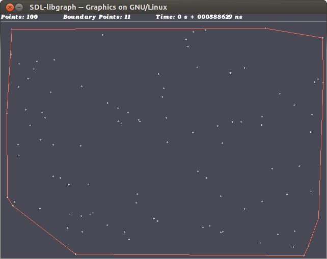

Based on the definition from  [Princeton](http://www.cs.princeton.edu/courses/archive/spr10/cos226/demo/ah/ConvexHull.html), the convex hull of a set of points is:

- Formally: It is the smallest convex set containing the points.  
- Informally: It is a rubber band wrapped around the "outside" points.

This application was designed to compare time complexity of convex hull problem in both parallel and sequential algorithms. The convex hull problem is solved based on the  [Graham's scan](http://www.cs.princeton.edu/courses/archive/spr10/cos226/demo/ah/GrahamScan.html) algorithm.

## Techniques

-   Parallelization using  [OpenMPI](http://www.open-mpi.org/)  in C++
-   Graphical visualization using C++ Graphics library (Linux)



## Source Code
https://github.com/farshidtz/convexhull  
[Graph Library](libgraph.tar.gz)