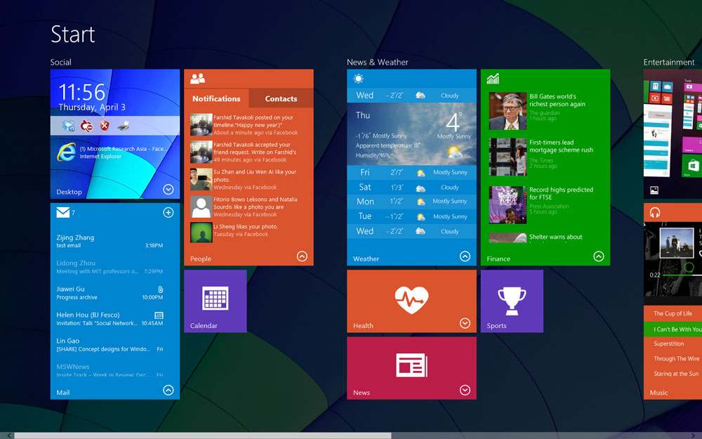
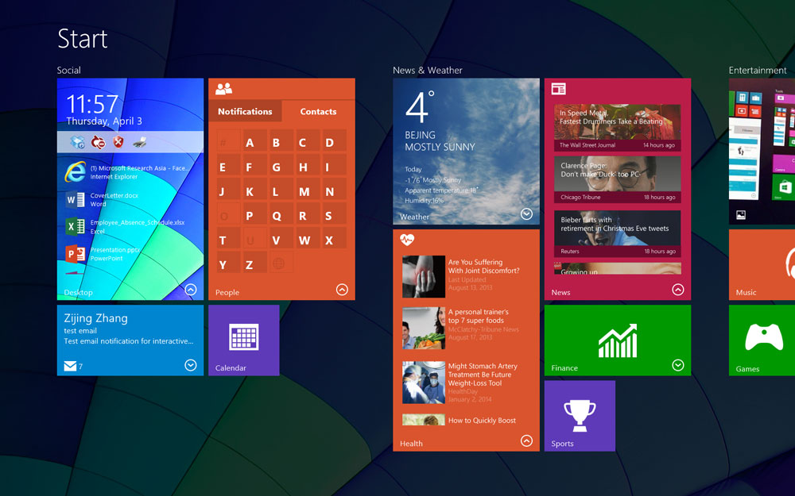
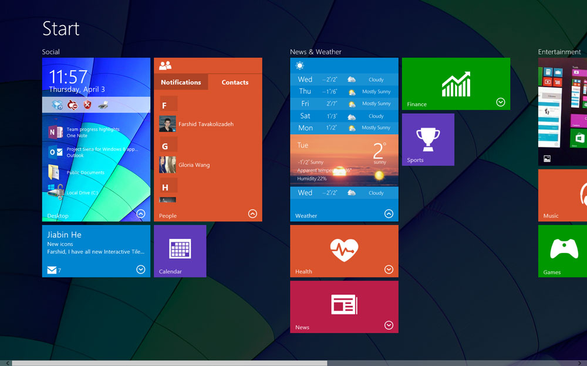
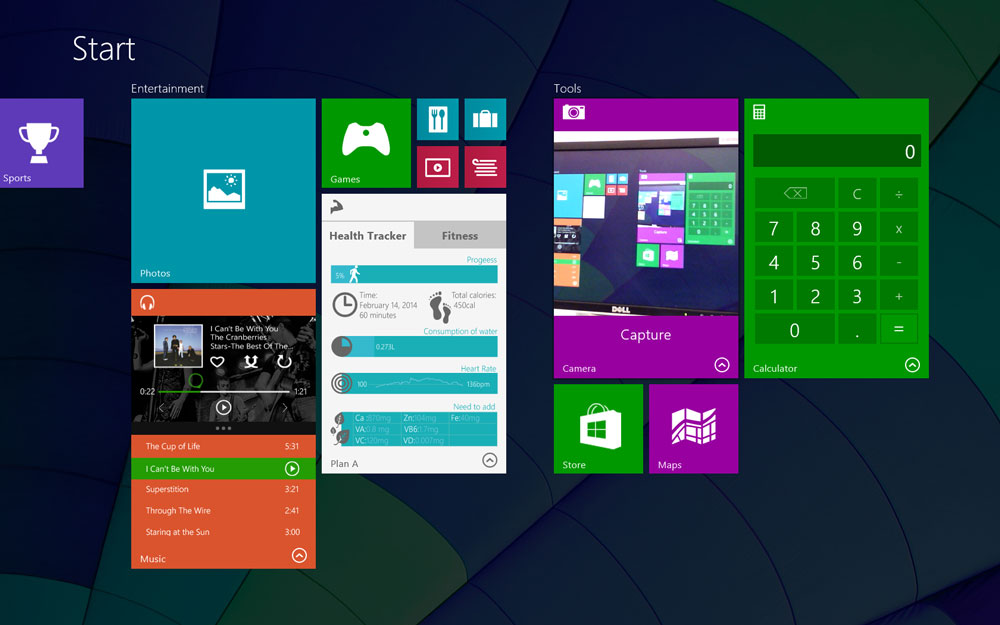
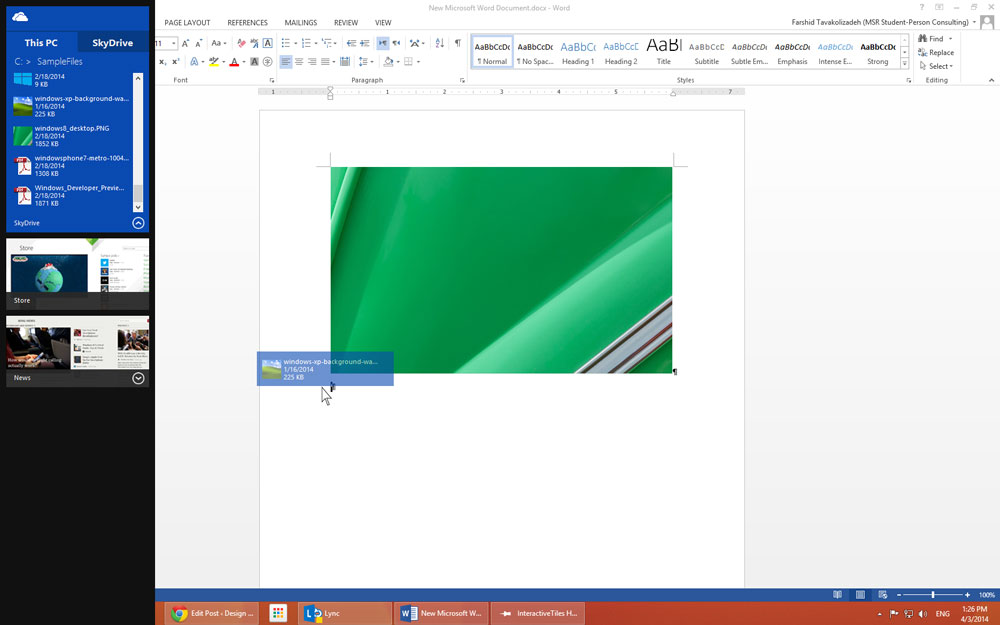
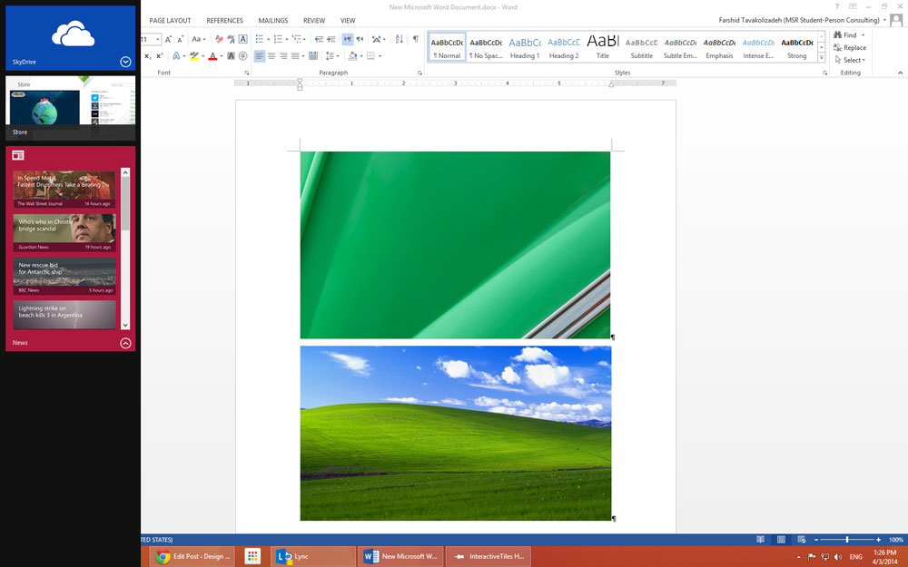

In an effort to make Windows more touch-friendly, Microsoft introduced the Modern Design Language (Previously known as Metro UI). Starting from Windows 8.0, the new modern interface was added to the operating system, replacing (and in some cases, overlapping) the classic interface elements. The changes however reduced the usability of interface for larger screen and mouse users.

At the Human-Computer Interaction group of Microsoft Research, the design team joined forces to propose a wide range of improvements to make the modern interface richer and more closely coupled with the classic interface. The proposal was presented as a fully-functional demo in Techfest '14, Microsoft's yearly event that covers internal cutting-edge research projects.

This project is a property of Microsoft Research, done at the Human-Computer Interaction group at MSRA.

## Patents

-   [Expandable Application Representation and Taskbar](http://www.freepatentsonline.com/y2015/0286387.html). US Patent 20,150,286,387, 2005, MICROSOFT CORPORATION.
-   [Expandable Application Representation, Milestones, and Storylines](http://www.freepatentsonline.com/y2015/0293888.html). US Patent 20,150,293,888,  2005,  MICROSOFT CORPORATION.
-   [Expandable Application Representation](http://www.freepatentsonline.com/y2015/0286352.html). US Patent 20,150,286,352, 2015, MICROSOFT CORPORATION.
-   [Expandable Application Representation, Activity Levels, and Desktop Representation](http://www.freepatentsonline.com/y2015/0286351.html). US Patent 20,150,286,351, 2015, MICROSOFT CORPORATION.
-   [Expandable Application Representation and Sending Content](http://www.freepatentsonline.com/y2015/0286350.html). US Patent 20,150,286,350, 2015, MICROSOFT CORPORATION.

# Screenshots

# Demo


--
